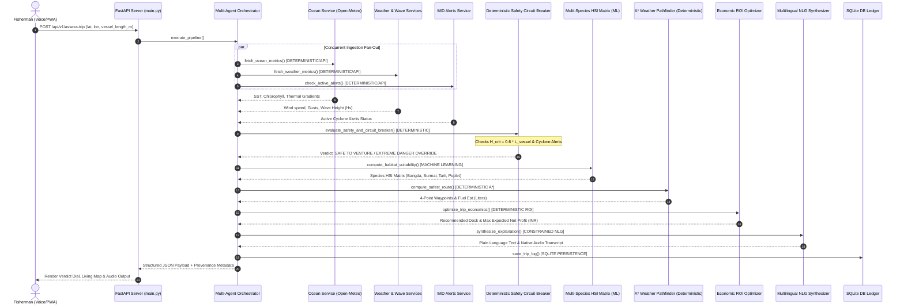

# ORCA 4.0 System Architecture & Microservice Execution Blueprint
> **Problem Statement ID**: SIH26176 | **Sponsoring Organization**: ISRO (Department of Space)

---

## 🏗️ Architectural Separation Directive: Deterministic vs ML vs LLM

To ensure absolute safety, auditability, and production reliability, ORCA 4.0 enforces strict boundaries:

1. **Deterministic Microservices (Pure Compiled Python, <10ms, No Models, No LLMs)**:
   - All safety-critical decisions, geofencing checks, vessel capsizing physics, and official alert overrides run as deterministic code.
   - *Why*: Artificial Intelligence models and LLMs are probabilistic and can hallucinate. A safety circuit breaker MUST be 100% auditable and non-bypassable.

2. **Machine Learning Inference Layer (XGBoost, Sobel 2D Filters, Monte Carlo)**:
   - Used exclusively for predictive optimization: Multi-Species Habitat Suitability Index ($HSI$), 1,000-Particle Search & Rescue Drift Simulator, Sobel Thermal Front extraction, and Dark-Fleet SAR Anomaly matching.
   - *Why*: Machine Learning excels at non-linear spatial pattern recognition. Its outputs are advisory.

3. **Constrained Conversational LLM / ASR Layer (Downstream Only)**:
   - Restricted strictly to: (1) Natural Language Intent Parsing (Voice/Text $\rightarrow$ JSON) and (2) Multilingual Plain-Language NLG Synthesis (Structured JSON $\rightarrow$ Native Audio).
   - *Why*: LLMs must sit *after* the safety decision has already been deterministically executed.

---

## 🔄 End-to-End Request Sequence Diagram (`/api/v1/assess-trip`)

